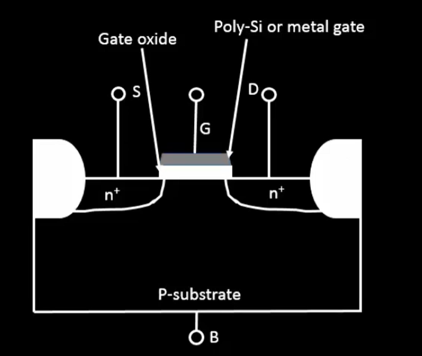
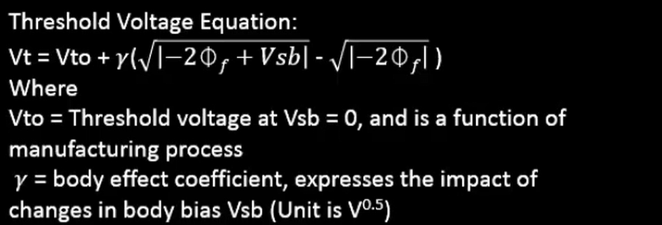
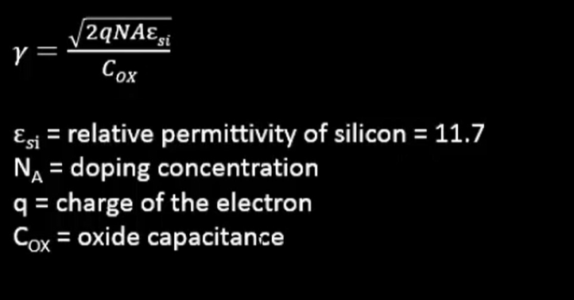
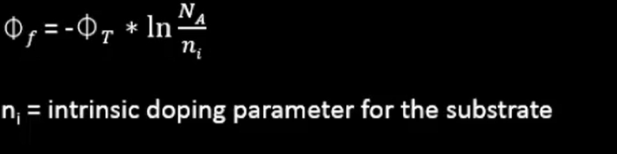

# Day 1: Basics of NMOS Drain Current (Id) vs Drain-to-source Voltage (Vds)

## Part 1: Introduction to Circuit Design and SPICE simulations
### The importance of W/L ratio
 - The W/L ratio determines a MOSFET’s strength — a higher W/L increases the drain current (Id), making the transistor faster. Since delay is inversely proportional to Id, a larger W/L ratio reduces propagation delay, improving circuit speed.
###  Need of SPICE
 - SPICE (Simulation Program with Integrated Circuit Emphasis) is used to analyze and verify circuit behavior before fabrication. It accurately simulates voltage, current, delay, and power at the transistor level, helping designers predict performance and detect errors early in the design process
### NMOS design and specifications

-   It is a four terminal deive
-   It consists of a P-substrate body
-   An isolation region created from SiO2 is present
-   n+ diffusion region is present near the SiO2 layer
-   It has a Gate oxide layer
-   A Poly-Si or metal gate layer is added on top of the gate oxide layer
-   There are a few abbreviations:
    -   G means Gate
    -   S means Source
    -   D means Drain
    -   B means Body or Bulk

•	Threshold Voltage (Vt)

  - The 'Vgs' voltage at which 'Strong Inversion' occurs is known as Threshold Voltage (Vt)

•	Concept of Strong Inversion

  - The phenomenon at which a part of the P-substrate becomes N-substrate (due to the high Vgs value) is called 'Strong Inversion'

•	Impact of Source-to-bulk Voltage (Vsb)

  - In presence of substrate bias voltage 'Vsb', an additional potential is required for strong inversion to occur

•	Threshold Voltage Equation

•	Body Effect Coefficient expression

•	Fermi Potential Equation

## Part 2: NMOS Resistive region and Saturation region of operation

-   It is also known as the Linear Region of operation
-   Since, Vgs=Vt, the changes that occur at different voltages of 'Vgs>Vt' are observed
-   In the channel, induced charge (Qi) α (Vgs-Vt)
-   The analysis is performed at Vgs=1V and a small (~0) Vds. Assume Vt=0.45V
-   In absence of Vds, the voltage across the n-channel was constant byt with application of Vds it is no more constant.
-   Let the effective channel length be L and 'x' axis be along the channel length and 'y' axis be perpendicular to the channel length
-   Let V(x) be the voltage at any point 'x' along the channel
-   Now, Vgs-V(x) is the gate-to-channel voltage at that point
-   Therefore, in the channel, induced charge at any point 'x' Qi(x) α - ((Vgs-V(x))-Vt)

• The two kinds of current: Drift current and Diffusion current

-   Drift current is the current due to the potential difference
-   Diffusion current is the current due to difference in carrier concentration

• The drift current (Id) = velocity of charge carriers \* available charge over the channel width

-   The term µn.Cox is denoted by kn' and kn' is known as process transconductance
-   kn'.(W/L) is denoted by kn and kn is also known as gain factor

• Condition on Vds for the MOSFET to be in linear/resistive region or saturation/pinch-off region

-   When Vds <= (Vgs-Vt), the MOSFET is in linear region of operation
-   For this region, Id=kn.(Vgs-Vt).Vds as (Vds^2)/2 is a very small amount in this case
-   Vdds can be sweeped from 0V to (Vgs-Vt)V to make the device work in linear region of operation
