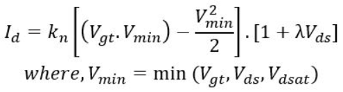
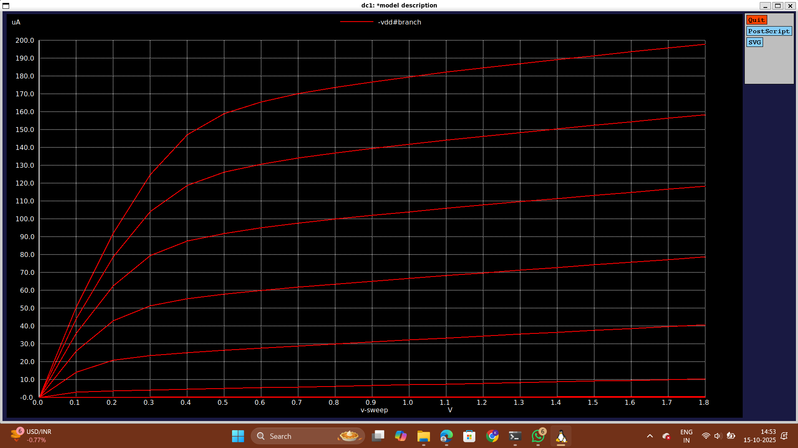

# Day 2: Velocity Saturation and basics of CMOS inverter VTC

## Part 1: SPICE simulation for lower nodes and velocity saturation effect
-   The theory about cut-off region of NMOS.
    
    -   When Vgs<Vt the region of operation of the NMOS is said to be the cut-off region
    -   Cut-off region is a region where the device has been cut-off or it is 'OFF'
-   Short channel effect
    
-   Velocity Saturation effect
    
    -   For the lower values of electric field, the velocity tends to be a linear function of the electric field. But, after a certain point (cut-off) the velocity just saturates. This point of saturation is represented by εc (critical electric field)
    -   Vn(m/S) = linear for ε<=εc
    -   Vn(m/S) = constant for ε>=εc
-  The modes of operation for long channel (>250nm) devices and short channel (<250nm) devices.
    
-   The modes of operation for long channel devices are:
    
    -   Cut-off region
    -   Resistive region
    -   Saturation region
-   The modes of operation for short channel devices are:
    
    -   Cut-off region
    -   Resistive region
    -   Velocity Saturation region
    -   Saturation region
-   Let's call (Vgs-Vt)=Vgt
    
-   The equation of Id for long channel and short channel devices

-   Vdsat is a technology parameter saturation voltage i.e voltage at which device velocity saturates and is independent of Vgs or Vds
    
-   The various modes when the value of Vmin is different
    
    -   When Vgt is the minimum of Vgt, Vds, Vdsat the device is in saturation region.
    -   When Vds is the minimum of Vgt, Vds, Vdsat the device is in resistive region.
    -   When Vdsat is the minimum of Vgt, Vds, Vdsat the device is in velocity saturation region.
    -   It looks like current should increase at lower nodes.
-   Velocity Saturation causes device to saturate early

## Lab1: 

```
*Model Description
.param temp=27

*Including sky130 library files
.lib "sky130_fd_pr/models/sky130.lib.spice" tt

*Netlist Description

XM1 Vdd n1 0 0 sky130_fd_pr__nfet_01v8 w=0.39 l=0.15
R1 n1 in 55

Vdd vdd 0 1.8V
Vin in 0 1.8V

*simulation commands

.op
.dc Vdd 0 1.8 0.1 Vin 0 1.8 0.2

.control

run
display
setplot dc1
.endc

.end
```

## Lab2:
```
*Model Description
.param temp=27

*Including sky130 library files
.lib "sky130_fd_pr/models/sky130.lib.spice" tt

*Netlist Description

XM1 Vdd n1 0 0 sky130_fd_pr__nfet_01v8 w=0.39 l=0.15
R1 n1 in 55

Vdd vdd 0 1.8V
Vin in 0 1.8V

*simulation commands

.op
.dc Vdd 0 1.8 0.1 Vin 0 1.8 0.2

.control

run
display
setplot dc1
.endc

.end
```
