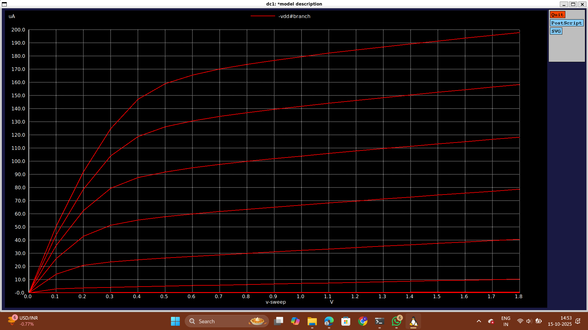
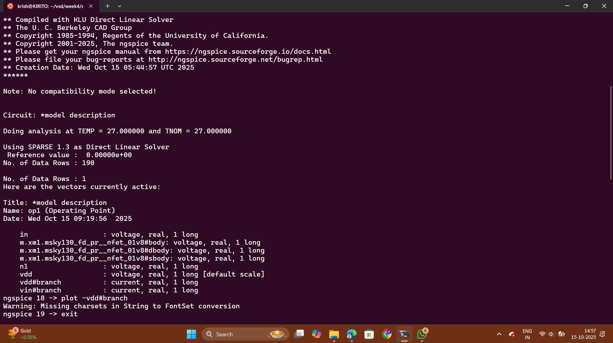
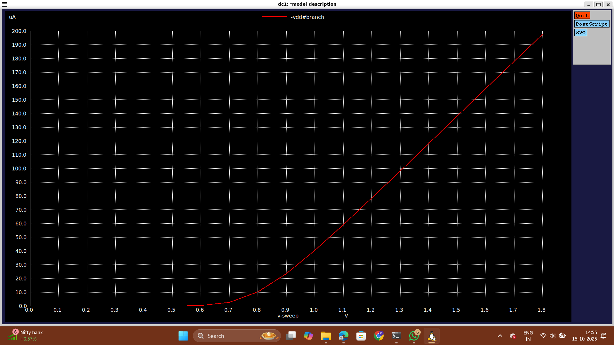
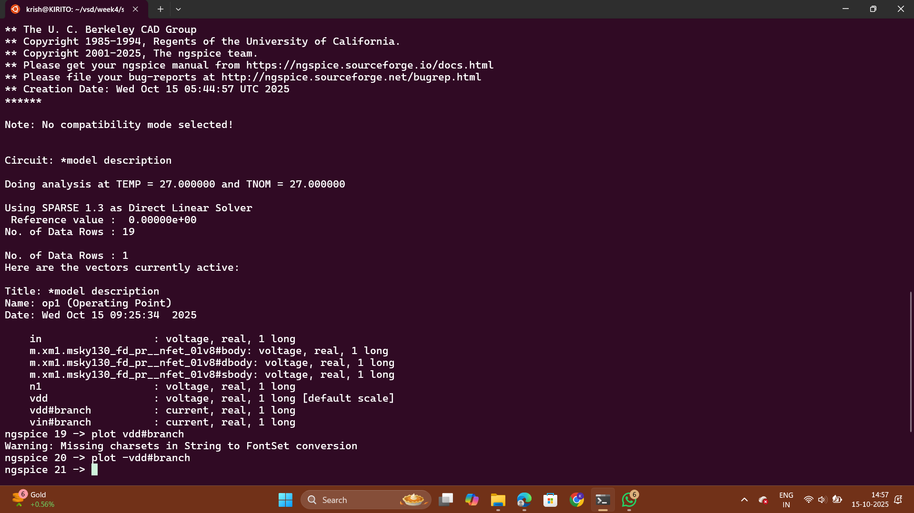

# Day 2: Velocity Saturation and basics of CMOS inverter VTC

## Part 1: SPICE simulation for lower nodes and velocity saturation effect
-   The theory about cut-off region of NMOS.
    
    -   When Vgs<Vt the region of operation of the NMOS is said to be the cut-off region
    -   Cut-off region is a region where the device has been cut-off or it is 'OFF'
-   Short channel effect
    
-   Velocity Saturation effect
    
    -   For the lower values of electric field, the velocity tends to be a linear function of the electric field. But, after a certain point (cut-off) the velocity just saturates. This point of saturation is represented by εc (critical electric field)
    -   Vn(m/S) = linear for ε<=εc
    -   Vn(m/S) = constant for ε>=εc
-  The modes of operation for long channel (>250nm) devices and short channel (<250nm) devices.
    
-   The modes of operation for long channel devices are:
    
    -   Cut-off region
    -   Resistive region
    -   Saturation region
-   The modes of operation for short channel devices are:
    
    -   Cut-off region
    -   Resistive region
    -   Velocity Saturation region
    -   Saturation region
-   Let's call (Vgs-Vt)=Vgt
    
-   The equation of Id for long channel and short channel devices

-   Vdsat is a technology parameter saturation voltage i.e voltage at which device velocity saturates and is independent of Vgs or Vds
    
-   The various modes when the value of Vmin is different
    
    -   When Vgt is the minimum of Vgt, Vds, Vdsat the device is in saturation region.
    -   When Vds is the minimum of Vgt, Vds, Vdsat the device is in resistive region.
    -   When Vdsat is the minimum of Vgt, Vds, Vdsat the device is in velocity saturation region.
    -   It looks like current should increase at lower nodes.
-   Velocity Saturation causes device to saturate early

## Lab1: 

```
*Model Description
.param temp=27

*Including sky130 library files
.lib "sky130_fd_pr/models/sky130.lib.spice" tt

*Netlist Description

XM1 Vdd n1 0 0 sky130_fd_pr__nfet_01v8 w=0.39 l=0.15
R1 n1 in 55

Vdd vdd 0 1.8V
Vin in 0 1.8V

*simulation commands

.op
.dc Vdd 0 1.8 0.1 Vin 0 1.8 0.2

.control

run
display
setplot dc1
.endc

.end
```


 - For short-channel MOSFETs, the Id–Vds curve shows early and incomplete saturation due to velocity saturation making the saturation region less flat compared to long-channel devices. also it becomes linear for high value of vgs . It remains quadratic for small value od Vgs

## Lab2:
```
*Model Description
.param temp=27

*Including sky130 library files
.lib "sky130_fd_pr/models/sky130.lib.spice" tt

*Netlist Description

XM1 Vdd n1 0 0 sky130_fd_pr__nfet_01v8 w=0.39 l=0.15
R1 n1 in 55

Vdd vdd 0 1.8V
Vin in 0 1.8V

*simulation commands

.op
.dc Vdd 0 1.8 0.1 Vin 0 1.8 0.2

.control

run
display
setplot dc1
.endc

.end
```


 - It shows the Id-Vgs curve for short channel mos. we can see that the equation is linear for high value of Vgs. This can also be used to find the threshold value of the mos by finding the slope of the linear part which here comes to be about 0.77V.
 - In short-channel MOSFETs, the Id–Vgs curve appears more linear at high Vgs because velocity saturation occurs. As the electric field near the channel increases, carrier velocity reaches its saturation limit and no longer increases proportionally with Vgs. This causes the drain current to grow almost linearly with Vgs instead of quadratically as in long-channel devices.


## Part 2: CMOS voltage transfer characteristics (VTC)
-   Transistor as a switch
    
    -   With infinite 'Off' resistance when |Vgs|<|Vt|
    -   With finite 'On' resistance when |Vgs|>|Vt|
-   The working of CMOS inverter
    
-   What happens when Vin is ‘high’ and equal to ‘vdd’
    
    -   PMOS turns 'OFF'
    -   NMOS turns 'ON'
-   What happens when Vin is ‘low’ and equal to ‘0V’
    
    -   PMOS turns 'ON'
    -   NMOS turns 'OFF'
-   The flow of current when Vin is ‘high’ and when Vin is ‘low’
    
-   When Vin=Vdd
    
    -   Direct path exists between Vout and Vss resulting in Vout=0V
-   When Vin=0V
    
    -   Direct path exists between Vdd and Vout, resulting in Vout=Vdd
