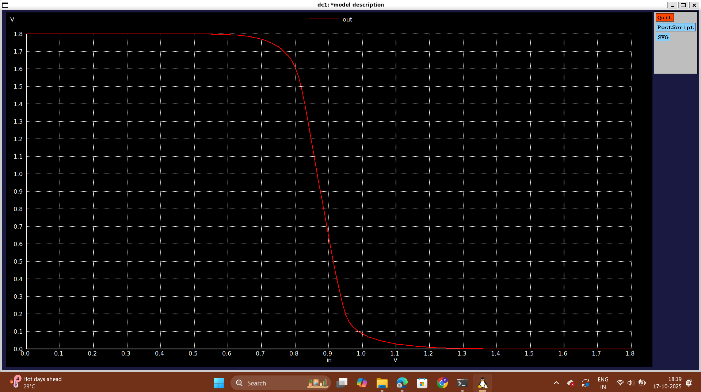
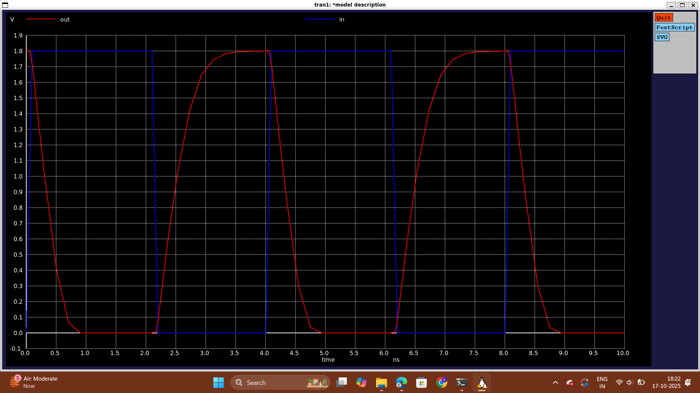

# Day 3: CMOS switching threshold and dynamic simulations

## Part 1: Voltage transfer characteristics and SPICE simulations
-   The various components of a SPICE deck:
    
    -   Component connectivity
    -   Component values
    -   Identification of 'nodes'
    -   Naming 'nodes'
  The SPICE code for the cmos inverter netlist looks something like following:
```

***MODEL Description***
***NETLIST Description***
M1 out in vdd vdd pmos W=0.375u L=0.25u
M2 out in  0   0  nmos W=0.375u L=0.25u

cload out 0 10f

Vdd vdd 0 2.5
Vin  in 0 2.5

***SIMULATION Commands***
.op
.dc Vin 0 2.5 0.05

***.include tsmc_025um_model.mod***
.LIB "tsmc_025um_model.mod" CMOS_MODELS
.end
```

### Lab Activity:
For plotting the Vtc characteristics of CMOS inverter, the following code is needed:
```
*Model Description
.param temp=27

*Including sky130 library files
.lib "sky130_fd_pr/models/sky130.lib.spice" tt

*Netlist Description

XM1 out in vdd vdd sky130_fd_pr__pfet_01v8 w=0.84 l=0.15
XM2 out in 0 0 sky130_fd_pr__nfet_01v8 w=0.36 l=0.15

Cload out 0 50fF

Vdd vdd 0 1.8V
Vin in 0 1.8V

*simulation commands

.op

.dc Vin 0 1.8 0.01

.control
run
setplot dc1
display
.endc

.end
```

The snap shot of the output window for plotting the Vtc characteristics of CMOS inverter

-   To find the switching threshold voltage (Vm), it is known that Vout = Vin so zoom in on the plot where roughly Vout = Vin by selecting the area of the plot by right clicking on the screen and dragging it to select the area.
-   Zoom twice or thrice until the point where Vm lies becomes almost certain.
-   Left click roughly on the point on the curve where Vm should approximately lie.
-   Values of x0 and y0 will now appear on the terminal window.
-   Since we are finding Vm, therefore x0 ~ y0 and hence x0=y0=Vm.
For performing the transient analysis, the following code is required:
```
*Model Description
.param temp=27

*Including sky130 library files
.lib "sky130_fd_pr/models/sky130.lib.spice" tt

*Netlist Description

XM1 out in vdd vdd sky130_fd_pr__pfet_01v8 w=0.84 l=0.15
XM2 out in 0 0 sky130_fd_pr__nfet_01v8 w=0.36 l=0.15

Cload out 0 50fF

Vdd vdd 0 1.8V
Vin in 0 PULSE(0V 1.8V 0 0.1ns 0.1ns 2ns 4ns)

*simulation commands

.tran 1n 10n

.control
run
.endc

.end
```

The snap shot of the output window for performing the transient analysis

-   To calculate the rise delay:
    -   Zoom on the part of the curve having fall of the input pulse and rise of the output pulse around voltage of (Vdd/2) by right clicking on the screen and dragging it to select the area.
    -   Now, left click on the rising edge of the output curve at (Vdd/2) to get a point x0,y0 on the terminal.
    -   Similarly, get the point at (Vdd/2) for falling edge of the input curve.
    -   The difference between the x-coordinate of the rising edge of the output curve and the falling edge of the input curve is the rise delay.
-   To calculate the falling delay:
    -   Zoom on the part of the curve having rise of the input pulse and fall of the output pulse around voltage of (Vdd/2) by right clicking on the screen and dragging it to select the area.
    -   Now, left click on the falling edge of the output curve at (Vdd/2) to get a point x0,y0 on the terminal.
    -   Similarly, get the point at (Vdd/2) for rising edge of the input curve.
    -   The difference between the x-coordinate of the falling edge of the output curve and the rising edge of the input curve is the fall delay.
