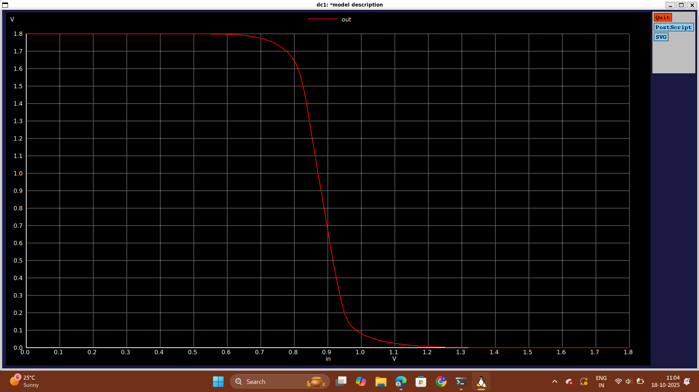
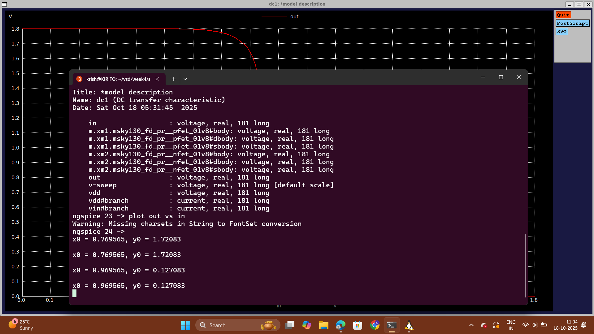

# Day 4: CMOS Noise Margin Robustness Evaluation

##  Part 1: Static Behavior Evaluation - CMOS Inverter Robustness: Noise Margin

* The noise margins of the inverter at different values of Wp/Lp were observed and they were as follows:

| (Wp/Lp) | x.(Wn/Ln) | NMh | NMI | Vm |
| :---: | :---: | :---: | :---: | :---: |
| (Wp/Lp) | 1.(Wn/Ln) | 0.3 | 0.3 | 0.99V |
| (Wp/Lp) | 2.(Wn/Ln) | 0.35 | 0.3 | 1.2V |
| (Wp/Lp) | 3.(Wn/Ln) | 0.4 | 0.3 | 1.25V |
| (Wp/Lp) | 4.(Wn/Ln) | 0.42 | 0.27 | 1.35V |
| (Wp/Lp) | 5.(Wn/Ln) | 0.42 | 0.27 | 1.4V |

-   A few conclusions can be inferred from the above table: - When `(Wp/Lp) = 2.(Wn/Ln)` there is a rise at the NMh because PMOS is responsible for holding the charges on the capacitance. When the size of PMOS is increased, a low-resistance path from supply to the capacitance is formed and as a result of that, the capacitance is able to retain the charge for a longer amount of time resulting in an increased NMh. - When `(Wp/Lp) = 4.(Wn/Ln)` there is a drop at the NMl because the NMOS has now become weaker than the PMOS - When `(Wp/Lp) = 5.(Wn/Ln)` the NMh almost comes to a static point. - In the above table, NMl is not affected much but NMh has increased by 120mV but this range is still acceptable and this proves the CMOS inverter robustness with respect to the Noise Margin. - Finally, the areas that can be used for digital and analog applications are stated in the figure below:

### Lab Activity
```
*Model Description
.param temp=27

*Including sky130 library files
.lib "sky130_fd_pr/models/sky130.lib.spice" tt

*Netlist Description

XM1 out in vdd vdd sky130_fd_pr__pfet_01v8 w=1 l=0.15
XM2 out in 0 0 sky130_fd_pr__nfet_01v8 w=0.36 l=0.15

Cload out 0 50fF

Vdd vdd 0 1.8V
Vin in 0 1.8V

*simulation commands

.op

.dc Vin 0 1.8 0.01

.control
run
setplot dc1
display
.endc

.end
```


The snap shot of the output window for calculating the Noise Margins

Method to calculate the Noise Margins from the plot:
Run the ngspice command and open the plot
left click on the point towards the top of the graph where the curvature seems to be '-1'
In this case it was x0 = 0.766667, y0 = 1.71351
Now, left click on the point towards the bottom of the graph where the curvature seems to be '-1'
In this case it was x0 = 0.977333, y0 = 0.110811. Let's consider these points as x1 and y1 thus making the coordinates x1 = 0.977333, y1 = 0.110811
For noise margin high we need Voh-Vih and in this case Voh=y0 and Vih=x1
For noise margin low we need Vil-Vol and in this case Vil=x0 and Vol=y1
Therefore, we get NMh = 0.736177 and NMl = 0.655856
