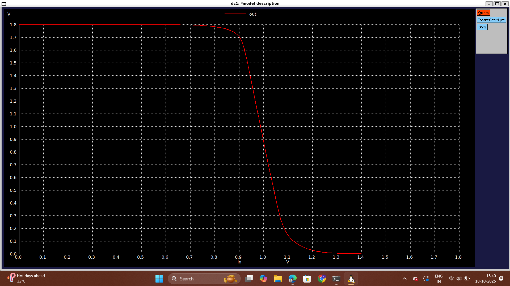

# Day 5: CMOS Power supply and device variation robustness evaluation

## Part 1: Static Behavior Evaluation - CMOS Inverter Robustness: Power Supply Variation
-   Whenever we move from 250nm nodes to lower nodes like 20nm or so on, we scale our supply voltage as well. For example, if things were working at 1V sometime back, now they will be operating at 0.7V
    
-   A CMOS inverter can be operated at 0.5V as well and it has it's own advantages and disadvantages:
    
    -   Advantages of using 0.5V supply:
        -   There is a significant increase in gain (close to 50% improvement)
        -   There is a significant reduction in energy consumption (close to 90% improvement)
    -   Disadvantages of using 0.5V supply:
        -   Performance impact (0.5V supply rising and falling edge is insufficient to completely charge or discharge the load capacitance)

  ### Lab :
```
*Model Description
.param temp=27

*Including sky130 library files
.lib "sky130_fd_pr/models/sky130.lib.spice" tt

*Netlist Description

XM1 out in vdd vdd sky130_fd_pr__pfet_01v8 w=1 l=0.15
XM2 out in 0 0 sky130_fd_pr__nfet_01v8 w=0.36 l=0.15

Cload out 0 50fF

Vdd vdd 0 1.8V
Vin in 0 1.8V

.control

let powersupply = 1.8
alter Vdd = powersupply
        let voltagesupplyvariation = 0
        dowhile voltagesupplyvariation < 6
        dc Vin 0 1.8 0.01
        let powersupply = powersupply - 0.2
        alter Vdd = powersupply
        let voltagesupplyvariation = voltagesupplyvariation + 1
      end

plot dc1.out vs in dc2.out vs in dc3.out vs in dc4.out vs in dc5.out vs in dc6.out vs in xlabel "input voltage(V)" ylabel "output voltage(V)" title "Inveter dc characteristics as a function of supply voltage"

.endc

.end
```


The snap shot of the output window to observe the power supply variation
## Part 2: Static Behavior Evaluation - CMOS Inverter Robustness: Device Variation
-   There are two sources for device variation:
    
    -   Etching Process Variation
    -   Oxide Thickness
-   Etching Process Variation:
    
    -   The etching process will define the structures in the layout of the CMOS inverter.
    -   Etching is a very important fabrication step
    -   It is the process that defines the structure (width and the height)
    -   Based on the structures that get defined by the process, it directly impacts the delay
-   In layout of the CMOS inverter we have:
    
    -   P-diffusion region which is indicated by green color.
    -   Poly-silicon area which is indicated by red color.
    -   Metal layer which is indicated by blue color.
    -   N-diffusion region indicated by yellow color.
    -   Contacts between two layers indicated by black crosses.
-   Thickness of poly-silicon layer is the gate length annd it defiens at which node we are (20nm, 30nm, 45nm, etc.).
    
-   Thickness of the P-diffusion layer is the width of the gate of the PMOS and the thickness of the N-diffusion layer is the width of the gate of the NMOS.
    
-   Width identifies overlap area between the diffusion layer and the poly-silicon layer.
    
-   Fabrication is basically a lab where we have a lot of things like chemicals, water, gases, etc. running and due to these the ideal structure is distorted.
-   Inverter Chain:
    
    -   When inverters are connected back-to-back they are collectively called as "Inverter Chain".
    -   In an inverter chain, the gates in the middle have same structures on both sides. So, it's very likely that this particular gate structure will have a repeated distortion because they are exposed to same kind of structures.
    -   In an inverter chain, gates in the middle will have a structure which is different from the gates at the ends because they might be connected to different devices that will impact the gates
-   Oxide Thickness:
    
    -   In an ideal oxidation process, the gate oxide thickness will be constant throughout the process.
    -   In real oxidation process, the gate oxide thickness will not be constant along the gate length.
    -   In an inverter chain, the gate oxide thickness can vary for each transistor.
    -   Oxide thickness directly affects the Id equation because Cox is dependant on it.
-   Strong PMOS:
    
    -   PMOS with less resistance (possibly least resistance if the size chosen is the greatest size possible)
    -   PMOS is wider in size (possibly widest PMOS available)
-   Weak NMOS:
    
    -   NMOS with high resistance (possibly highest resistance if the size chosen is the least size possible)
    -   NMOS is small in size (possibly smallest NMOS available)
-   Strong NMOS:
    
    -   NMOS with less resistance (possibly least resistance if the size chosen is the greatest size possible)
    -   NMOS is wider in size (possibly widest NMOS available)
-   Weak PMOS:
    
    -   PMOS with high resistance (possibly highest resistance if the size chosen is the least size possible)
    -   PMOS is small in size (possibly smallest PMOS available)
-   With the variation from Weak PMOS - Strong NMOS to Strong PMOS - Weak NMOS, the switching threshold varies from roughly 0.7V to 1.4V which is fairly acceptable because behavior of the inverter is intact
    
-   We can plot the variation if we move from Weak PMOS - Strong NMOS to Strong PMOS - Weak NMOS using SPICE simulation and the plot is given below:

### Lab:
```
*Model Description
.param temp=27

*Including sky130 library files
.lib "sky130_fd_pr/models/sky130.lib.spice" tt

*Netlist Description

XM1 out in vdd vdd sky130_fd_pr__pfet_01v8 w=7 l=0.15
XM2 out in 0 0 sky130_fd_pr__nfet_01v8 w=0.42 l=0.15

Cload out 0 50fF

Vdd vdd 0 1.8V
Vin in 0 1.8V

*simulation commands

.op

.dc Vin 0 1.8 0.01

.control
run
setplot dc1
display
.endc

.end
```


The snap shot of output window to observe device variation

